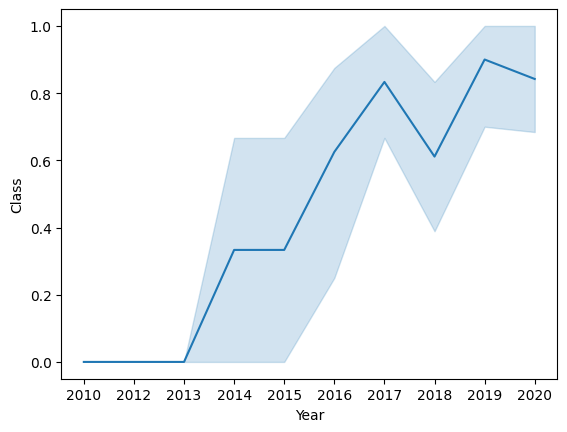
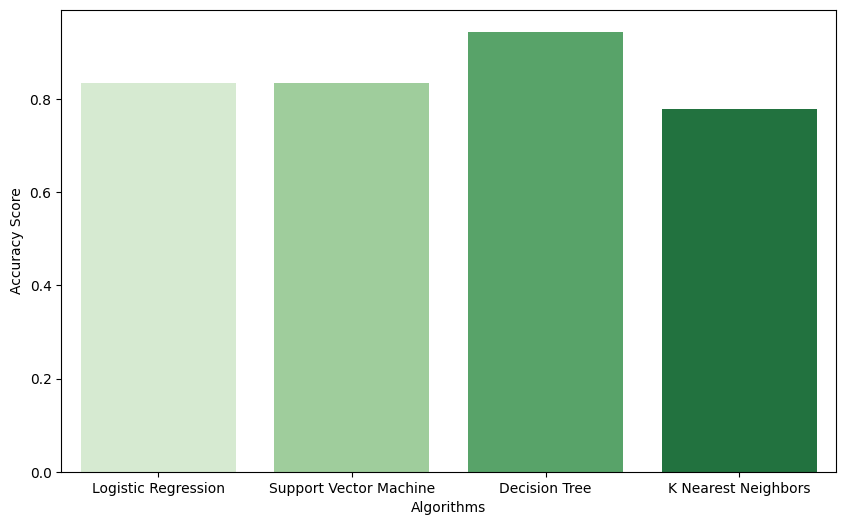

# **Space X  Falcon 9 First Stage Landing Prediction**
# Overview
The goal of this project was to analyze and predict the successful `landing of the Falcon 9 first stage`. This project utilized data from the `SpaceX API` to provide valuable insights into the factors influencing rocket landing success. Multiple classification models were built, including, Logistic Regression, Support Vector Machine, K-Nearest Neighbors and Decision Trees which emerged as the top-performing algorithm, achieving an accuracy of `94.44%` after hyperparameter tuning. By using the model to accurately determining whether the first stage will land successfully for future launches, the `cost of a launch` can be estimated.

# Business Understanding
The cost of a Falcon 9 launch, at `$62 million`, is notably lower than competitors' offerings, which can exceed `$165 million` per launch. SpaceX's competitive advantage lies in the `reusability of the first stage`, resulting in significant cost savings compared to other providers in the space launch industry. This cost information can be invaluable for potential competitors looking to bid against SpaceX for rocket launch contracts.

# Data Understanding
The dataset for the SpaceX Falcon 9 First Stage Landing Prediction project is sourced from `SpaceX's API`, containing records of Falcon 9 rocket launches. It includes data on launch sites, flight numbers, payload masses, orbit types, and success outcomes. `Exploratory data analysis` revealed insights such as the relationship between launch site and success rates, payload mass, orbit type, and flight number. The line chart below shows the yearly trend indicates that between 2010 and 2013, **all landings were unsuccessful**, success rates increased post-2013 with minor dips in 2018 and 2020, and after 2016, there was consistently over a **50% chance of success**.

Additionally, launch sites were analyzed to find that all SpaceX sites are located on U.S. coasts, near railways and highways, while maintaining a safe distance from cities. `Feature engineering` was done to obtained important variables that would affect the success rate.

# Modeling and Evaluation
Before building of predictive models, determination of training labels, data standardization, and the division of the dataset into training and test sets were done. Using GridSearch, the best hyperparameters were attained for SVM, Logistic Regression, KNN models and `Classification Trees` which was the top-performing algorithm. The Decision Tree model achieved a best_score of 88.75% after tuning the hyperparameters and performed with `accuracy of 94.44%`, showcasing its reliability in predicting landing outcomes. The bar plot below shows the accuracy score for all the four predictive models tested in this project.

# Conclusion
This project not only predicts Falcon 9 `first stage landings` but also highlights the significant `cost-saving` potential associated with successful landings. SpaceX's competitive advantage in offering cost-effective rocket launches heavily relies on this ability to reuse the first stage. In the future, adding more information like `weather-related` data since weather conditions can significantly influence the outcome of a rocket launch, may contribute to enhanced decision-making and mission success in space exploration efforts.

----
----
----

# installation
- Clone this repo to your computer. git clone <[repository_url](https://github.com/farahdahir/SpaceX_Falcon9)>
